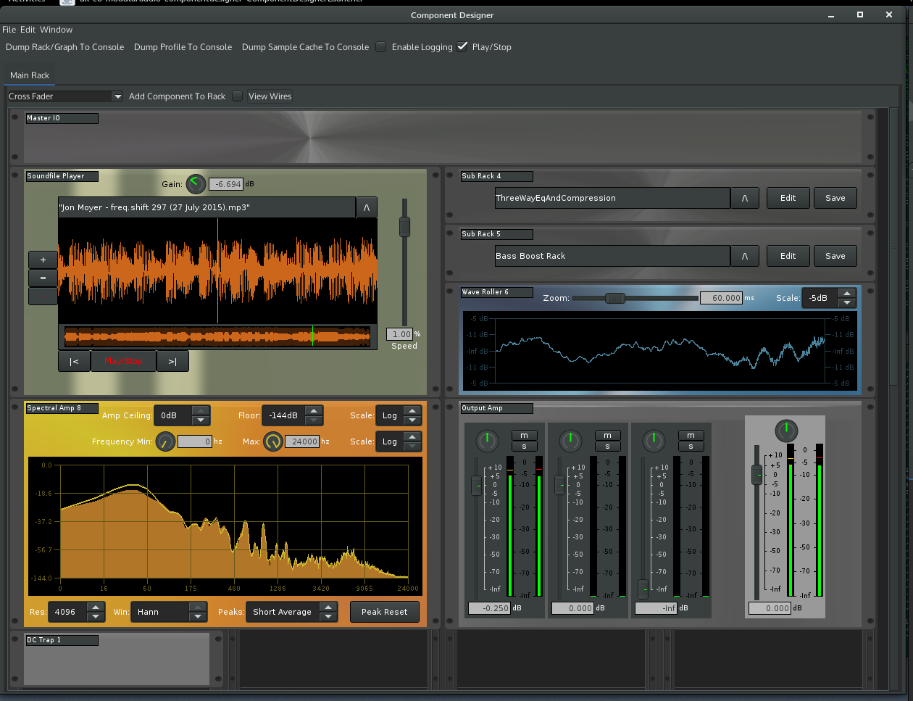
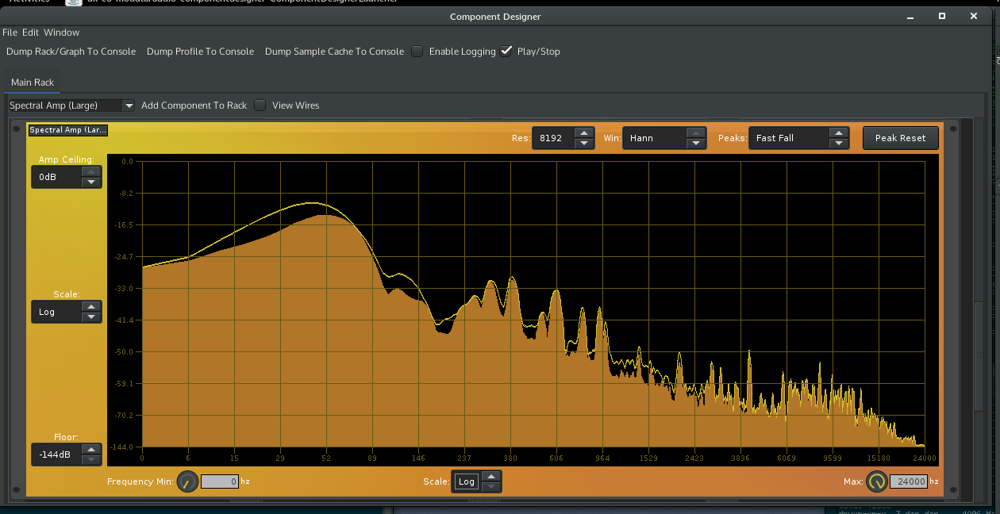

# Mad Java
A Java based modular audio dsp prototyping application that allows wiring of audio components together.

The application supports the idea of "racks" and "sub racks" allowing the creation of re-usable components using composition.

Currently a small number of semi-usable components exist, whilst a number of other audio components are in progress.

# 0.0.3 Screenshots
Playing a soundfile</img>
Analysing the spectrum of a signal</img>

# Building And Running
Currently development is done using Eclipse and JDK 1.8 on a Linux machine with Jack 2.

Building from source is most easily accomplished using Gradle, but still needs some things installed:

* Appropriate development tools like a compile and linker
* Development headers for JNI, libsndfile and libmpg123
* pkgconfig on your path along with an appropriate PKG_CONFIG_PATH variable to pick up libsndfile + libmpg123
* Swig
* /bin/sh

1. Clone using git. If you're feeling adventurous use HEAD, otherwise I'd recommend using the latest tagged version (should be 0.0.3 as of writing this).

2. Verify your path includes access to swig and pkgconfig (try running them to be sure)

3. Make sure that the 1.8 JDK you're using has JAVA_HOME set to the right place

4. Change to the root directory you checked out (mad-java)

5. Run the build with:
   ./gradlew appRelease
   (You can use ./gradle appRelease is you've got gradle already installed - I use 2.5)

6. This will create mad-pp-$VERSION.tar.gz which you can safely extract where you would like it to live.

7. After extracting the archive somewhere, you can launch the application with:
   ./launchcd.sh

8. If you want to play some soundfiles, open the preferences and change the "Music" directory to where your music lives.

9. Open one of the example racks - iSoundfilePlayerWithBassBoost.xml for example.

# Known Issues

1. All of the non-release components (what you see when you add --alpha on the command line) have sizing issues - I modified the rack spacing and haven't yet had the time to update the layouts and component sizes.

2. A lof of the components don't currently do extensive checking. By playing around with some of the sliders and/or input values you can get them to spit out NaNs that will cause the whole signal chain to choke.

3. Performance - Java makes it rather tricky to get consistently reliable low latency audio in the same process as something using Swing. At some point I'll have to look into separating the front and back ends and leaving the DSP processing in a VM where there are minimal allocations at run time.

4. Multi-core doesn't currently work well. I'm not sure I'll go any further with this as (3) needs to be solved first before looking into multi-core. The issue is that any additional rendering threads need to be created via jack so they have the appropriate priority.