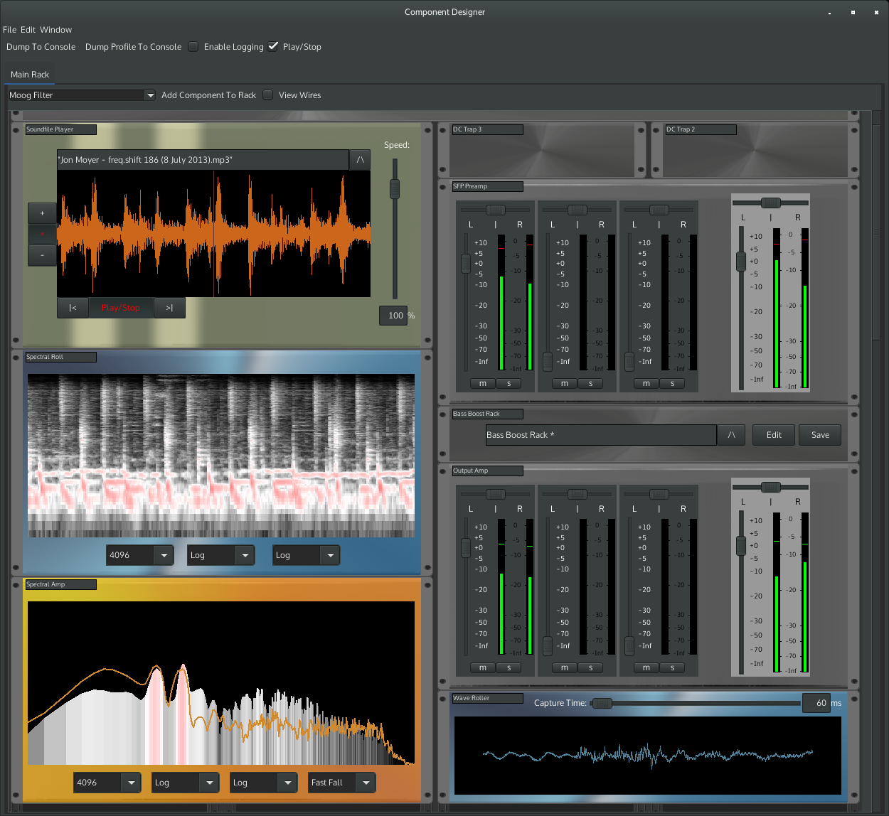
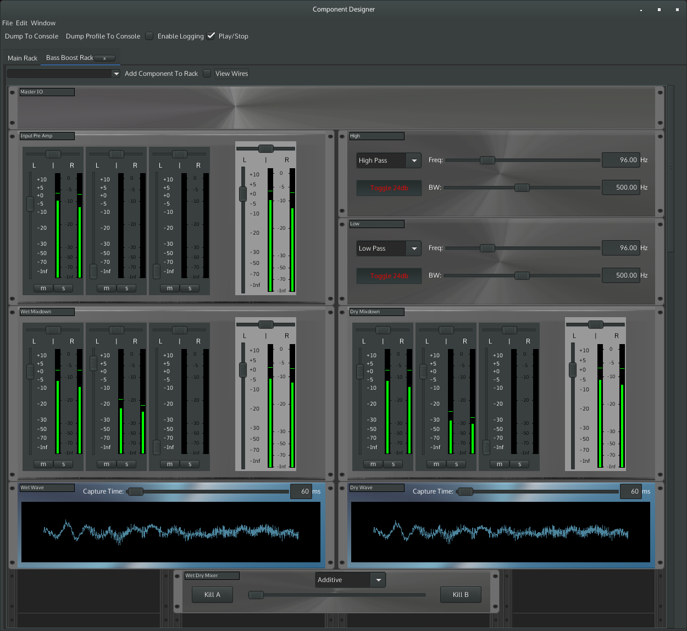
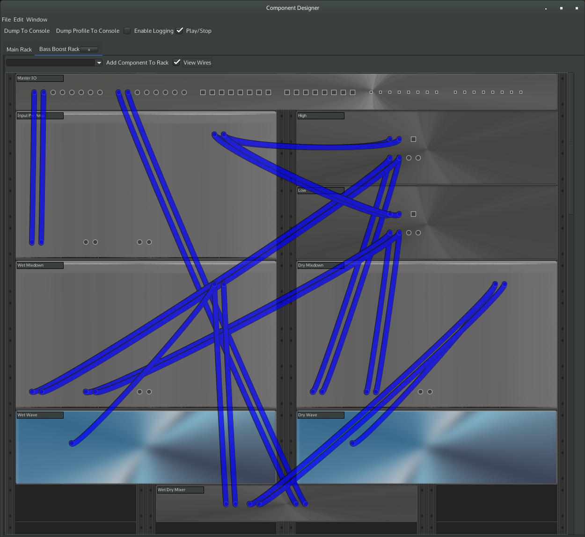

# Mad Java
A Java based modular audio dsp prototyping application that allows wiring of audio components together.

The application supports the idea of "racks" and "sub racks" allowing the creation of re-usable components using composition.

Currently a small number of semi-usable components exist, whilst a number of other audio components are in progress.

# Screenshots
Playing a soundfile</img>
A rack boosting the bass of a signal</img>
The wiring behind the bass booster</img>

# Building And Running
Currently development is done using Eclipse and JDK 1.8 on a Linux machine with Jack 2.

1. Check out using git.

2. Pull down the libraries it depends on using the shell script (it will need wget in your path):
    ```
    cd mad-java/4EXTERNAL/external-libs/scripts
    ./fetchandextractlibs.sh
    ```

    This will populate the libs directory as needed.

3. Add the git repository you just cloned in the eclipse git perspective.

4. Import all the projects it finds under there.

5. We need to generate some jaxb marshalling code in the rack-marshalling-jaxb project - launch the ant build.xml found in the project.

6. Refresh, things should start building.

7. Build the native library for getting the thread ID in util-native. You will need to make sure that your JAVA_HOME environment is correctly set up.

   ```
   cd $CHECKOUTDIR/3UTIL/util-native/csrc
   ./buildit.sh
   ```

   This should place it where eclipse will pick it up and use it.

7. Launch the component-designer java application - uk.co.modularaudio.componentdesigner.ComponentDesigner - but we'll need to pass some arguments to the application so it find the necessary image and support files.

   ```
   ComponentDesigner --development
   ```

   Don't forget that you will need to ensure that Jack2 is already running before launching.

   * Note - the first launch can potentially take a long time - it generates a cache of band limited wave files for the internal oscillators (I'll change this at some point, but for now that's what it is up to) *

8. You should see the ComponentDesigner main window and the initially empty rack.

9. You can now add (for example) a sound file player component to the rack, and wire its output to the output in the master IO at the top. Don't forget to wire up the outputs inside the Jack manager you are using too (e.g. QJackctl).

10. A couple of example racks can be found in:
    1PROJECTS/COMPONENTDESIGNER/component-designer/userpatches

    And example sub-racks in:
    1PROJECTS/COMPONENTDESIGNER/component-designer/usersubpatches

11. Further tweaking - you can also add the following switches:

    | switch    | description                                                                             |
    |-----------|-----------------------------------------------------------------------------------------|
    | --useSlaf | use the gtk2 style platform look and feel. works best with a dark one like dark-adwaita |
    | --beta    | show released and beta level DSP components                                             |
    | --alpha   | show all components include alpha and beta ones                                         |

# Known Issues

1. Hardcoded paths for a few things - it would be nice to make some configurable and settable via the preferences windows

2. Mp3 seeking issues - the seek in the MP3 SPI package isn't sample accurate and there's bugs there around when it hits the end of a song file.
   In an ideal world it needs replacing with a JNI/JNA interface to libsndfile and libmpeg123

3. All of the non-release components (what you see when you add --alpha) have sizing issues - I modified the rack spacing and haven't yet had the time to update the layouts and component sizes.

4. Creating "loops" in the audio graph causes exceptions in the logs, and in some cases hard crashes. Requires a bit more of an in depth look to work out how to create the appropriate feedback loop MADs and wire them in (and out when one of the loop causing links is removed).

5. A lof of the components don't currently do extensive checking. By playing around with some of the sliders and/or input values you can get them to spit out NaNs that will cause the whole signal chain to choke.

6. Performance - Java makes it rather tricky to get consistently reliable low latency audio in the same process as something using Swing. At some point I'll have to look into separating the front and back ends and leaving the DSP processing in a VM where there are minimal allocations at run time.
